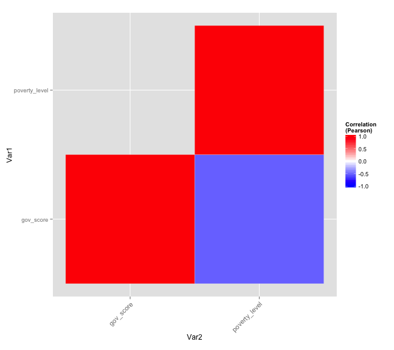

## Analysis and Results
**Livelihoods**

<iframe src=' assets/fig/livelihoods1-1.html ' scrolling='no' frameBorder='0' seamless class='rChart nvd3 ' id=iframe- chart71046c1882d ></iframe> 

--- &carousel

## Assets

*** {class: active, img: "assets/img/poverty_namunyak/nm_livelihoods.pdf"}
Main Livelihood Options: Namunyak

*** {img: "assets/img/poverty_namunyak/income_importance.jpg"}
Importance of Income Sources: Namunyak

*** {img: "assets/img/poverty_namunyak/income_type_sub.jpg"}
Income of Livestock vs Non-Livestock Households: Namunyak

*** {img: "assets/img/poverty_namunyak/lhds_heads_livestock.jpg"}
Livestock Related Activities

*** {class: active, img: "assets/img/poverty_namunyak/avg_livestock.jpg"}
Average Livestock Numbers: Namunyak

*** {img: "assets/img/poverty_namunyak/no_livestock.jpg"}
Households with No Livestock: Namunyak

*** {img: "assets/img/poverty_namunyak/poverty_sub.jpg"}
Poverty Line by sublocation: Namunyak

--- &twocol

## Overview of NRT Governance Scores
***=left
**NRT Governance Scores**

- Modular
 - 15 Parameters
 - Sub-parameters
 
- Qualitative
 - Score: Subjective
 - Range: 0-2
 
- Annual
- Report Cards
- Adaptive Management

***=right
**Community Feedback**

- Social COMMS
 - Collect annually
 - Need to integrate into score
 - Unbiased
 
- Map neglected areas
- "Benefit" assessment
- "Impact" asessment

--- #myslide2

<iframe src="https://dgohil.shinyapps.io/gov_scomms/", width=500, height=600></iframe>

--- &vcenter

## Governance Score and Poverty

 

--- #myslide

## Analysis and Results

<iframe src="https://dgohil.shinyapps.io/app2/", width=500, height=600></iframe>

--- #rangelands

## Rangelands

<iframe src="https://dgohil.shinyapps.io/rangelands/", width=500, height=600></iframe>

--- &vcenter

## Livestock Movement Areas
**Wet Season**

<table border=1>
<tr> <th>  </th> <th> Ilngwesi </th> <th> Kalama </th> <th> lekurruki </th> <th> meibae  </th> <th> Melako </th> <th> Nakuprat_Gotu </th> <th> namunyak </th> <th> sera </th> <th> westgate </th>  </tr>
  <tr> <td align="right"> Laikipia </td> <td align="right">  </td> <td align="right">  </td> <td align="right"> 0.99 </td> <td align="right"> 0.03 </td> <td align="right">  </td> <td align="right">  </td> <td align="right"> 0.00 </td> <td align="right"> 0.00 </td> <td align="right"> 0.02 </td> </tr>
  <tr> <td align="right"> Isiolo </td> <td align="right">  </td> <td align="right">  </td> <td align="right"> 0.00 </td> <td align="right"> 0.03 </td> <td align="right">  </td> <td align="right">  </td> <td align="right"> 0.01 </td> <td align="right"> 0.00 </td> <td align="right"> 0.01 </td> </tr>
  <tr> <td align="right"> Samburu </td> <td align="right">  </td> <td align="right">  </td> <td align="right"> 0.00 </td> <td align="right"> 0.94 </td> <td align="right">  </td> <td align="right">  </td> <td align="right"> 0.99 </td> <td align="right"> 1.00 </td> <td align="right"> 0.97 </td> </tr>
  <tr> <td align="right"> Meru </td> <td align="right">  </td> <td align="right">  </td> <td align="right"> 0.00 </td> <td align="right"> 0.00 </td> <td align="right">  </td> <td align="right">  </td> <td align="right"> 0.00 </td> <td align="right"> 0.00 </td> <td align="right"> 0.00 </td> </tr>
  <tr> <td align="right"> Marsabit </td> <td align="right">  </td> <td align="right">  </td> <td align="right"> 0.00 </td> <td align="right"> 0.00 </td> <td align="right">  </td> <td align="right">  </td> <td align="right"> 0.00 </td> <td align="right"> 0.00 </td> <td align="right"> 0.00 </td> </tr>
  <tr> <td align="right"> Other </td> <td align="right">  </td> <td align="right">  </td> <td align="right"> 0.00 </td> <td align="right"> 0.00 </td> <td align="right">  </td> <td align="right">  </td> <td align="right"> 0.00 </td> <td align="right"> 0.00 </td> <td align="right"> 0.00 </td> </tr>
   </table>

**Dry Season**
<table border=1>
<tr> <th>  </th> <th> Ilngwesi </th> <th> Kalama </th> <th> lekurruki </th> <th> meibae  </th> <th> Melako </th> <th> Nakuprat_Gotu </th> <th> namunyak </th> <th> sera </th> <th> westgate </th>  </tr>
  <tr> <td align="right"> Laikipia </td> <td align="right">  </td> <td align="right">  </td> <td align="right"> 0.71 </td> <td align="right"> 0.34 </td> <td align="right">  </td> <td align="right">  </td> <td align="right"> 0.15 </td> <td align="right"> 0.01 </td> <td align="right"> 0.15 </td> </tr>
  <tr> <td align="right"> Isiolo </td> <td align="right">  </td> <td align="right">  </td> <td align="right"> 0.08 </td> <td align="right"> 0.06 </td> <td align="right">  </td> <td align="right">  </td> <td align="right"> 0.15 </td> <td align="right"> 0.08 </td> <td align="right"> 0.25 </td> </tr>
  <tr> <td align="right"> Samburu </td> <td align="right">  </td> <td align="right">  </td> <td align="right"> 0.00 </td> <td align="right"> 0.49 </td> <td align="right">  </td> <td align="right">  </td> <td align="right"> 0.45 </td> <td align="right"> 0.65 </td> <td align="right"> 0.55 </td> </tr>
  <tr> <td align="right"> Meru </td> <td align="right">  </td> <td align="right">  </td> <td align="right"> 0.20 </td> <td align="right"> 0.01 </td> <td align="right">  </td> <td align="right">  </td> <td align="right"> 0.04 </td> <td align="right"> 0.03 </td> <td align="right"> 0.00 </td> </tr>
  <tr> <td align="right"> Marsabit </td> <td align="right">  </td> <td align="right">  </td> <td align="right"> 0.00 </td> <td align="right"> 0.09 </td> <td align="right">  </td> <td align="right">  </td> <td align="right"> 0.22 </td> <td align="right"> 0.20 </td> <td align="right"> 0.06 </td> </tr>
  <tr> <td align="right"> other </td> <td align="right">  </td> <td align="right">  </td> <td align="right"> 0.01 </td> <td align="right"> 0.01 </td> <td align="right">  </td> <td align="right">  </td> <td align="right"> 0.00 </td> <td align="right"> 0.02 </td> <td align="right"> 0.00 </td> </tr>
   </table>

---

## Wildlife: Conflict Types

<iframe src=' assets/fig/wildlife1-1.html ' scrolling='no' frameBorder='0' seamless class='rChart nvd3 ' id=iframe- chart710470900df ></iframe> 

---

## Security: Conflict Types

---

## Questions?

**Who should use the data?**
 - NRT
 - Conservancy Management and Boards
 - Government
 - Conservation and Development Stakeholders

**What should they do with it?**
 - Action Plans
 - Development Plans/Vision
 - Monitoring Impact

--- &twocol_48 #action 

## Action Plans

*** =left

Use Data

Community and Conservancy Management and Development Plans

- Natural Resources
 - Increasing
 - Forests
 - Rangelands
 - Water
- Human Development
 - Poverty
 - Livelihoods
 - Education
 - Health
- Security
 - Poaching
 - Cattle Rustling

   
*** =right

</img>

--- &twocol

## Challenges

*** =left
- Lack of Buy In
 - "NRT Thing"
- Multiple research fronts
 - What information is required by whom?
- Lack of Data Use
- Need for standardized reporting
- Limited information sharing avenues

***What is the purpose of Social COMMS?***
- Information needs & uses
 - Timelines
- Communication

*** =right

**Next Steps**
- Standardized reporting template
- Survey Revision
- Frequency of Social COMMS
- Determine Scale
- Budgets and Timelines
- Rollout

--- {
tpl: thankyou
}

## Thank You

For more information you can contact:

Deepali Gohil

+254 702 788 055

deepali.gohil@nrt-kenya.org

